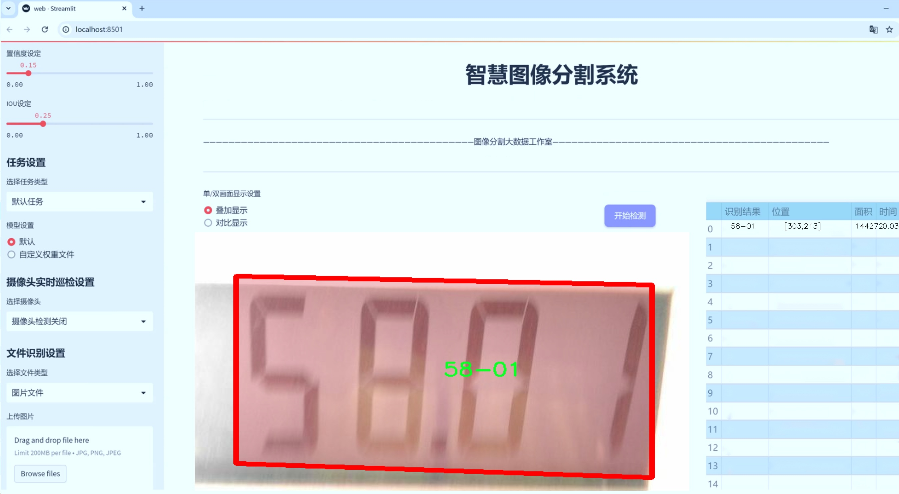
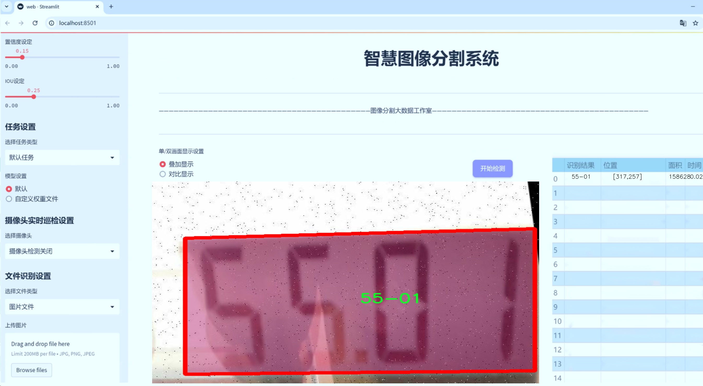
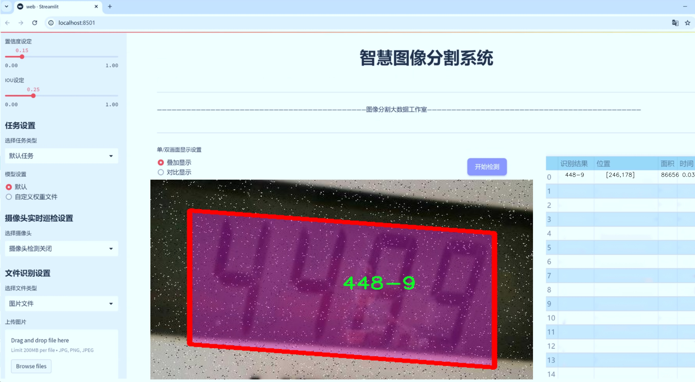
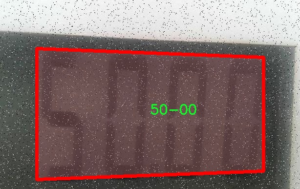
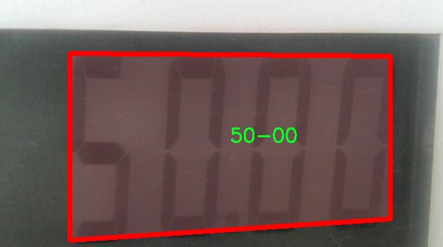
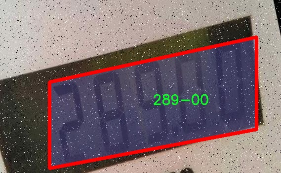
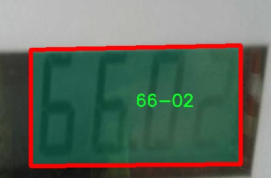
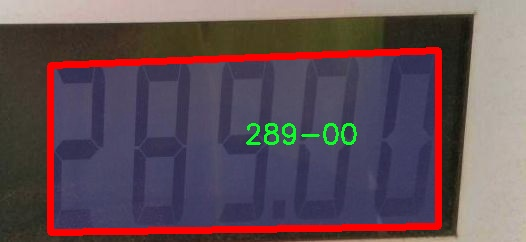

# 七段数码管显示器字符分割系统源码＆数据集分享
 [yolov8-seg-C2f-RFAConv＆yolov8-seg-timm等50+全套改进创新点发刊_一键训练教程_Web前端展示]

### 1.研究背景与意义

项目参考[ILSVRC ImageNet Large Scale Visual Recognition Challenge](https://gitee.com/YOLOv8_YOLOv11_Segmentation_Studio/projects)

项目来源[AAAI Global Al lnnovation Contest](https://kdocs.cn/l/cszuIiCKVNis)

研究背景与意义

随着智能设备的普及和信息化时代的到来，数字显示技术在各类电子产品中扮演着越来越重要的角色。七段数码管作为一种经典的数字显示方式，广泛应用于家电、仪器仪表、交通指示等领域。其简洁的结构和直观的显示效果，使得七段数码管在各种场合中仍然保持着不可替代的地位。然而，随着应用场景的多样化和用户需求的不断提升，传统的七段数码管显示技术面临着新的挑战，尤其是在字符识别和分割的准确性与效率方面。因此，开发一种高效的字符分割系统，能够准确识别和分割七段数码管显示的字符，具有重要的理论价值和实际意义。

在这一背景下，基于改进YOLOv8的七段数码管显示器字符分割系统应运而生。YOLO（You Only Look Once）系列模型以其高效的实时目标检测能力而受到广泛关注。YOLOv8作为该系列的最新版本，结合了深度学习和计算机视觉的前沿技术，具备了更强的特征提取能力和更快的推理速度。通过对YOLOv8的改进，针对七段数码管的特定需求，能够显著提升字符分割的准确性和实时性，为各类应用提供更加可靠的技术支持。

本研究所使用的数据集“7segment_crop_train”包含2000张图像，涵盖475个类别，涉及多种不同的字符组合和显示状态。这一丰富的数据集为模型的训练和评估提供了坚实的基础。通过对该数据集的深入分析和处理，可以有效提高模型在不同场景下的适应能力和鲁棒性。此外，数据集中包含的多样化字符组合，如数字、字母及特殊符号，能够使模型在实际应用中更具普适性和灵活性。

本研究的意义不仅在于技术层面的创新，更在于推动智能显示技术的发展。通过改进YOLOv8，构建高效的字符分割系统，可以为智能家居、智能交通、医疗设备等领域的数字显示提供更为精准的解决方案。同时，该系统的成功应用也将为后续相关研究提供借鉴，推动字符识别和分割技术在更广泛领域的应用。

综上所述，基于改进YOLOv8的七段数码管显示器字符分割系统的研究，不仅具有重要的学术价值，也具备广泛的应用前景。通过本研究的开展，期望能够为数字显示技术的进步贡献一份力量，同时为智能设备的进一步发展奠定基础。

### 2.图片演示







##### 注意：由于此博客编辑较早，上面“2.图片演示”和“3.视频演示”展示的系统图片或者视频可能为老版本，新版本在老版本的基础上升级如下：（实际效果以升级的新版本为准）

  （1）适配了YOLOV8的“目标检测”模型和“实例分割”模型，通过加载相应的权重（.pt）文件即可自适应加载模型。

  （2）支持“图片识别”、“视频识别”、“摄像头实时识别”三种识别模式。

  （3）支持“图片识别”、“视频识别”、“摄像头实时识别”三种识别结果保存导出，解决手动导出（容易卡顿出现爆内存）存在的问题，识别完自动保存结果并导出到tempDir中。

  （4）支持Web前端系统中的标题、背景图等自定义修改，后面提供修改教程。

  另外本项目提供训练的数据集和训练教程,暂不提供权重文件（best.pt）,需要您按照教程进行训练后实现图片演示和Web前端界面演示的效果。

### 3.视频演示

[3.1 视频演示](https://www.bilibili.com/video/BV1gP2PYSExW/)

### 4.数据集信息展示

##### 4.1 本项目数据集详细数据（类别数＆类别名）

nc: 487
names: ['000340-7', '0003972-2', '000530-1', '000542-8', '000680-4', '0013643-9', '002063-1', '0025243-4', '002590-4', '002719-5', '002924-9', '003310-0', '003795-5', '00414-4', '004210-5', '004303-6', '007205-4', '00822-4', '00839-0', '008701-3', '010555-1', '011903-7', '01441-8', '014958-0', '01974-6', '03401-6', '03525-9', '03526-0', '03556-7', '03662-0', '03876-7', '08724-3', '088952-3', '100-00', '100-02', '100-04', '10082-1', '1010-8', '1025-0', '103-02', '103-71', '104.00', '105-01', '106-00', '106-02', '1060-0', '107-01', '108-00', '109-02', '109-76', '110-03', '111-00', '112-00', '112-01', '113-00', '114-00', '114-02', '115-00', '117-00', '1192-7', '120-00', '120-52', '120-88', '122-00', '123-00', '125-01', '126-00', '128-00', '128-28', '129-00', '130-84', '1305-7', '135-00', '1368-3', '1369-3', '138-01', '140-01', '142-06', '143-01', '144-0', '146-02', '147-00', '148-00', '150-01', '150-46', '151-0', '153-05', '154-01', '156-01', '1573-1', '161-00', '161-01', '165-01', '166-00', '167-00', '169-00', '17-74', '17-89', '170-1', '171-00', '172-00', '172-3', '173-00', '174-01', '175-00', '176-0', '176-00', '177-00', '177-01', '177-02', '178-01', '18-00', '18-01', '180-00', '1809-5', '182-00', '183-01', '186-00', '186-02', '187-00', '188-01', '189-00', '190-00', '191-00', '191-01', '1922-8', '193-01', '193-8', '194-00', '194-1', '194-51', '194-6', '195-00', '196-00', '197-3', '198-01', '198-03', '198-6', '199-0', '199-00', '199-8', '2', '20-00', '200-00', '200-7', '201-0', '201-00', '202-00', '203-00', '204-0', '205-00', '205-68', '206-00', '206-01', '207-0', '207-00', '207-02', '207-4', '208-0', '208-00', '209-00', '209-50', '21-00', '21-01', '21-59', '210-0', '210-00', '210-2', '211-00', '211-02', '2110-0', '212-00', '212-01', '212-60', '213-00', '213-8', '214-00', '215-00', '215-01', '215-7', '216-00', '216-78', '218-00', '219-00', '22-00', '22-54', '220-0', '220-00', '220-1', '221', '221-00', '222-00', '222-49', '223-01', '224-00', '225-0', '225-01', '228-00', '228-27', '23', '23-0', '23-00', '23-28', '230-00', '231-00', '232-01', '234-00', '234-01', '235-0', '235-00', '236-1', '237-00', '238-00', '239-00', '24-01', '240-00', '245-00', '246-00', '25-00', '25-42', '25-76', '26-01', '262-00', '264-00', '267-00', '27-00', '27-01', '275-0', '275-00', '276-00', '28-00', '28-66', '280-00', '282-00', '287-00', '289-00', '29-00', '29-04', '294-01', '297-01', '298-6', '3-00', '3-01', '30-0', '30-00', '30-01', '301-8', '305-0', '31-00', '31-88', '310-01', '3126-2', '32-01', '3247-0', '33', '33-00', '33-01', '33-24', '330-00', '34-00', '34-01', '34-02', '35-0', '35-00', '35-01', '35-28', '353-3', '36-00', '36-01', '36-39', '365-01', '37-0', '37-00', '37-01', '37-02', '37-46', '376-01', '38-00', '38-01', '380-00', '39-00', '39-01', '39-02', '39-95', '3939-3', '40-00', '40-01', '4059-9', '41-00', '41-01', '411-4', '415-00', '416-00', '42-0', '42-00', '42-02', '42-03', '42-28', '42-90', '425-00', '425-01', '43-0', '43-00', '43-01', '43-02', '43-78', '44-00', '44-01', '44-02', '440-0', '448-9', '45-00', '45-46', '45-6', '4540-9', '46-', '46-0', '46-00', '46-01', '46-57', '46-61', '464-00', '47-00', '47-01', '47-02', '47-90', '47-93', '48-00', '48-01', '48-02', '485-03', '49-0', '49-00', '49-01', '49-2', '491-00', '496-1', '50-00', '50-01', '50-02', '50-69', '51-00', '51-01', '52-00', '52-01', '520-2', '524-9', '528-8', '53-00', '53-01', '53-37', '53-49', '53-81', '5371-6', '54-00', '54-01', '54-04', '54-98', '540-0', '5405-9', '55-0', '55-00', '55-01', '550', '5563-4', '56-0', '56-00', '57-00', '57-01', '57-03', '57-87', '57-92', '570-1', '570-3', '58-00', '58-01', '58-21', '58-78', '589-1', '59-0', '59-00', '59-01', '59-04', '59-19', '59-67', '590-7', '6', '6-19', '60-00', '60-01', '60-7', '60-9', '600-1', '61-00', '61-01', '61-79', '61-86', '62-00', '62-01', '62-02', '63-00', '63-01', '63-02', '63-38', '63-96', '63-97', '630-2', '637-3', '64-00', '64-01', '64-68', '65-00', '65-01', '66-', '66-0', '66-00', '66-01', '66-02', '66-04', '66-54', '66-62', '66-67', '67-00', '67-01', '67-98', '670-0', '672-7', '68-00', '68-01', '68-72', '68-81', '68-98', '69-00', '70-00', '70-01', '70-5', '7014-1', '7038-2', '7067-8', '71-00', '71-01', '71-02', '72-0', '72-00', '72-01', '7252-0', '73-01', '73-02', '74-00', '74-01', '74-53', '7494-2', '75-00', '76-00', '77-0', '77-00', '77-76', '78-00', '78-01', '78-58', '79-00', '80-0', '80-00', '80-01', '81-00', '82-51', '824-1', '83-0', '84-01', '84-82', '85-00', '85-01', '85-02', '85-04', '86-52', '86-83', '89', '89-00', '89-68', '91-01', '91-11', '91-67', '94-00', '95-02', '95-94', '98-00', '99-00']


##### 4.2 本项目数据集信息介绍

数据集信息展示

在本研究中，我们使用了名为“7segment_crop_train”的数据集，以训练和改进YOLOv8-seg模型，专注于七段数码管显示器字符的分割系统。该数据集的设计旨在提供丰富的样本，以便模型能够有效地识别和分割不同的字符。数据集包含487个类别，涵盖了多种不同的字符样式和格式，确保了模型在多样化输入下的鲁棒性和准确性。

数据集中的类别列表包括了从“000340-7”到“99-00”的多种字符，每个字符都有其独特的标识符。这些字符不仅包括数字，还包含了一些特定的符号和字母，极大地丰富了模型的学习能力。例如，字符“000340-7”与“0003972-2”之间的细微差别，要求模型具备较高的辨识能力，以确保在实际应用中能够准确地进行字符分割。通过引入如此多样化的字符，数据集为模型提供了广泛的训练基础，使其能够在各种情况下进行有效的字符识别。

数据集的构建过程考虑到了实际应用场景中的各种可能性。每个字符的图像都经过精心标注，确保了训练数据的高质量。数据集不仅包含了清晰的字符图像，还包括了不同光照、背景和视角下的样本，以模拟真实世界中的应用环境。这种多样性使得模型在训练过程中能够学习到更为复杂的特征，从而提高其在实际应用中的表现。

此外，数据集的设计还考虑到了字符的排列和组合方式。七段数码管显示器通常用于显示数字和特定的字母组合，因此数据集中不仅有单个字符的图像，还有字符组合的样本。这种设计使得模型能够更好地理解字符之间的关系，进而提升其在字符分割任务中的准确性。

在训练过程中，使用“7segment_crop_train”数据集将有助于模型在字符分割任务中实现更高的精度和效率。通过不断迭代和优化，模型将能够更好地适应各种输入情况，进而在实际应用中展现出卓越的性能。最终，我们期望通过这一数据集的训练，构建出一个高效、准确的七段数码管字符分割系统，为相关领域的应用提供强有力的支持。

综上所述，“7segment_crop_train”数据集不仅为YOLOv8-seg模型的训练提供了丰富的样本和多样化的字符类别，还通过精心设计的标注和多样化的输入场景，确保了模型在实际应用中的高效性和准确性。这一数据集的成功应用，将为未来在字符识别和分割领域的研究提供重要的参考和借鉴。











### 5.全套项目环境部署视频教程（零基础手把手教学）

[5.1 环境部署教程链接（零基础手把手教学）](https://www.bilibili.com/video/BV1jG4Ve4E9t/?vd_source=bc9aec86d164b67a7004b996143742dc)


[5.2 安装Python虚拟环境创建和依赖库安装视频教程链接（零基础手把手教学）](https://www.bilibili.com/video/BV1nA4VeYEze/?vd_source=bc9aec86d164b67a7004b996143742dc)

### 6.手把手YOLOV8-seg训练视频教程（零基础小白有手就能学会）

[6.1 手把手YOLOV8-seg训练视频教程（零基础小白有手就能学会）](https://www.bilibili.com/video/BV1cA4VeYETe/?vd_source=bc9aec86d164b67a7004b996143742dc)


按照上面的训练视频教程链接加载项目提供的数据集，运行train.py即可开始训练



     Epoch   gpu_mem       box       obj       cls    labels  img_size
     1/200     0G   0.01576   0.01955  0.007536        22      1280: 100%|██████████| 849/849 [14:42<00:00,  1.04s/it]
               Class     Images     Labels          P          R     mAP@.5 mAP@.5:.95: 100%|██████████| 213/213 [01:14<00:00,  2.87it/s]
                 all       3395      17314      0.994      0.957      0.0957      0.0843

     Epoch   gpu_mem       box       obj       cls    labels  img_size
     2/200     0G   0.01578   0.01923  0.007006        22      1280: 100%|██████████| 849/849 [14:44<00:00,  1.04s/it]
               Class     Images     Labels          P          R     mAP@.5 mAP@.5:.95: 100%|██████████| 213/213 [01:12<00:00,  2.95it/s]
                 all       3395      17314      0.996      0.956      0.0957      0.0845

     Epoch   gpu_mem       box       obj       cls    labels  img_size
     3/200     0G   0.01561    0.0191  0.006895        27      1280: 100%|██████████| 849/849 [10:56<00:00,  1.29it/s]
               Class     Images     Labels          P          R     mAP@.5 mAP@.5:.95: 100%|███████   | 187/213 [00:52<00:00,  4.04it/s]
                 all       3395      17314      0.996      0.957      0.0957      0.0845


### 7.50+种全套YOLOV8-seg创新点代码加载调参视频教程（一键加载写好的改进模型的配置文件）

[7.1 50+种全套YOLOV8-seg创新点代码加载调参视频教程（一键加载写好的改进模型的配置文件）](https://www.bilibili.com/video/BV1Hw4VePEXv/?vd_source=bc9aec86d164b67a7004b996143742dc)

### 8.YOLOV8-seg图像分割算法原理

原始YOLOv8-seg算法原理

YOLOv8-seg算法作为YOLO系列中的最新版本，代表了目标检测和实例分割领域的一次重要进步。其设计理念不仅继承了前几代YOLO模型的优点，还在多个方面进行了创新和优化，使其在精度和速度上都达到了新的高度。YOLOv8-seg的核心在于将目标检测与实例分割相结合，旨在为计算机视觉任务提供更为全面的解决方案。

首先，YOLOv8-seg的骨干网络（Backbone）采用了跨级结构（Cross Stage Partial, CSP）的思想，这一设计旨在增强特征提取的能力。YOLOv8在此基础上对YOLOv5中的C3模块进行了优化，替换为更轻量的C2f模块。C2f模块通过引入更多的跳层连接和Split操作，显著提高了特征流动的效率，确保了在不同尺度下都能提取到丰富的特征信息。此外，YOLOv8依然保留了空间金字塔池化（SPPF）模块，这一模块通过不同内核尺寸的池化操作，有效地合并了特征图，增强了模型对多尺度目标的检测能力。

在特征融合网络（Neck）部分，YOLOv8-seg采用了双塔结构，结合了特征金字塔网络（FPN）和路径聚合网络（PAN）。这种结构的设计使得语义特征和定位特征能够更好地融合，从而提升了模型对复杂场景的适应能力。通过这种方式，YOLOv8-seg能够在处理不同尺寸和不同类型的目标时，依然保持高效的检测性能。

YOLOv8-seg的检测模块（Head）是其创新的另一重要方面。与之前的耦合头结构不同，YOLOv8-seg采用了解耦头的设计，将分类和回归分支分离开来。这一变化不仅加速了模型的收敛速度，还提升了检测的准确性。同时，YOLOv8-seg引入了无锚点（Anchor-Free）检测机制，简化了目标检测的过程，减少了对先验框的依赖，从而使得模型在各种场景下都能更灵活地进行目标检测。

在损失函数的设计上，YOLOv8-seg采用了新的损失策略。通过变焦损失计算分类损失，并结合数据平均保真度损失和完美交并比损失对边界框损失进行计算，这种创新的损失函数设计使得模型在训练过程中能够更好地优化目标检测的性能。通过这种方式，YOLOv8-seg不仅提高了目标检测的精度，还增强了模型对小目标和复杂背景的适应能力。

此外，YOLOv8-seg在处理实例分割任务时，利用了新的样本匹配方式。这一方式通过对图像中的每个实例进行精确的分割，确保了模型在进行目标检测的同时，能够对每个目标进行细致的边界划分。这种能力在实际应用中尤为重要，尤其是在需要对复杂场景进行分析的任务中，YOLOv8-seg能够提供更为准确和细致的结果。

在数据处理方面，YOLOv8-seg引入了图像预处理和增强技术，包括Mosaic增强和瞄点计算。这些技术不仅提高了模型的鲁棒性，还在一定程度上减少了过拟合的风险。通过对输入数据的多样化处理，YOLOv8-seg能够在不同的环境和条件下，依然保持优异的检测性能。

总的来说，YOLOv8-seg算法通过对骨干网络、特征融合、检测模块和损失函数等多个方面的创新与优化，形成了一种高效、准确的目标检测与实例分割解决方案。其在计算机视觉领域的广泛应用潜力，使得YOLOv8-seg成为当前最先进的模型之一，尤其在实时目标检测和复杂场景分析中展现出了极大的优势。随着技术的不断进步，YOLOv8-seg无疑将在未来的研究和应用中发挥更为重要的作用。


### 9.系统功能展示（检测对象为举例，实际内容以本项目数据集为准）

图9.1.系统支持检测结果表格显示

  图9.2.系统支持置信度和IOU阈值手动调节

  图9.3.系统支持自定义加载权重文件best.pt(需要你通过步骤5中训练获得)

  图9.4.系统支持摄像头实时识别

  图9.5.系统支持图片识别

  图9.6.系统支持视频识别

  图9.7.系统支持识别结果文件自动保存

  图9.8.系统支持Excel导出检测结果数据


### 10.50+种全套YOLOV8-seg创新点原理讲解（非科班也可以轻松写刊发刊，V11版本正在科研待更新）

#### 10.1 由于篇幅限制，每个创新点的具体原理讲解就不一一展开，具体见下列网址中的创新点对应子项目的技术原理博客网址【Blog】：


[10.1 50+种全套YOLOV8-seg创新点原理讲解链接](https://gitee.com/qunmasj/good)

#### 10.2 部分改进模块原理讲解(完整的改进原理见上图和技术博客链接)【如果此小节的图加载失败可以通过CSDN或者Github搜索该博客的标题访问原始博客，原始博客图片显示正常】
### 深度学习基础
卷积神经网络通过使用具有共享参数的卷积运算显著降低了模型的计算开销和复杂性。在LeNet、AlexNet和VGG等经典网络的驱动下，卷积神经网络现在已经建立了一个完整的系统，并在深度学习领域形成了先进的卷积神经网络模型。

感受野注意力卷积RFCBAMConv的作者在仔细研究了卷积运算之后获得了灵感。对于分类、目标检测和语义分割任务，一方面，图像中不同位置的对象的形状、大小、颜色和分布是可变的。在卷积操作期间，卷积核在每个感受野中使用相同的参数来提取信息，而不考虑来自不同位置的差分信息。这限制了网络的性能，这已经在最近的许多工作中得到了证实。

另一方面，卷积运算没有考虑每个特征的重要性，这进一步影响了提取特征的有效性，并最终限制了模型的性能。此外，注意力机制允许模型专注于重要特征，这可以增强特征提取的优势和卷积神经网络捕获详细特征信息的能力。因此，注意力机制在深度学习中得到了广泛的应用，并成功地应用于各个领域。

通过研究卷积运算的内在缺陷和注意力机制的特点，作者认为现有的空间注意力机制从本质上解决了卷积运算的参数共享问题，但仍局限于对空间特征的认知。对于较大的卷积核，现有的空间注意力机制并没有完全解决共享参数的问题。此外，他们无法强调感受野中每个特征的重要性，例如现有的卷积块注意力模块（CBAM）和 Coordinate注意力（CA）。

因此，[参考该博客提出了一种新的感受野注意力机制（RFA）](https://qunmasj.com)，它完全解决了卷积核共享参数的问题，并充分考虑了感受野中每个特征的重要性。通过RFA设计的卷积运算（RFAConv）是一种新的卷积运算，可以取代现有神经网络中的标准卷积运算。RFAConv通过添加一些参数和计算开销来提高网络性能。

大量关于Imagnet-1k、MS COCO和VOC的实验已经证明了RFAConv的有效性。作为一种由注意力构建的新型卷积运算，它超过了由CAM、CBAM和CA构建的卷积运算（CAMConv、CBAMConv、CAConv）以及标准卷积运算。

此外，为了解决现有方法提取感受野特征速度慢的问题，提出了一种轻量级操作。在构建RFAConv的过程中，再次设计了CA和CBAM的升级版本，并进行了相关实验。作者认为当前的空间注意力机制应该将注意力放在感受野空间特征上，以促进当前空间注意力机制的发展，并再次增强卷积神经网络架构的优势。


### 卷积神经网络架构
出色的神经网络架构可以提高不同任务的性能。卷积运算作为卷积神经网络的一种基本运算，推动了人工智能的发展，并为车辆检测、无人机图像、医学等先进的网络模型做出了贡献。He等人认为随着网络深度的增加，该模型将变得难以训练并产生退化现象，因此他们提出了残差连接来创新卷积神经网络架构的设计。Huang等人通过重用特征来解决网络梯度消失问题，增强了特征信息，他们再次创新了卷积神经网络架构。

通过对卷积运算的详细研究，Dai等人认为，具有固定采样位置的卷积运算在一定程度上限制了网络的性能，因此提出了Deformable Conv，通过学习偏移来改变卷积核的采样位置。在Deformable Conv的基础上，再次提出了Deformable Conv V2和Deformable Conv V3，以提高卷积网络的性能。

Zhang等人注意到，组卷积可以减少模型的参数数量和计算开销。然而，少于组内信息的交互将影响最终的网络性能。1×1的卷积可以与信息相互作用。然而，这将带来更多的参数和计算开销，因此他们提出了无参数的“通道Shuffle”操作来与组之间的信息交互。

Ma等人通过实验得出结论，对于参数较少的模型，推理速度不一定更快，对于计算量较小的模型，推理也不一定更快。经过仔细研究提出了Shufflenet V2。

YOLO将输入图像划分为网格，以预测对象的位置和类别。经过不断的研究，已经提出了8个版本的基于YOLO的目标检测器，如YOLOv5、YOLOv7、YOLOv8等。上述卷积神经网络架构已经取得了巨大的成功。然而，它们并没有解决提取特征过程中的参数共享问题。本文的工作从注意力机制开始，从一个新的角度解决卷积参数共享问题。

### 注意力机制
注意力机制被用作一种提高网络模型性能的技术，使其能够专注于关键特性。注意力机制理论已经在深度学习中建立了一个完整而成熟的体系。Hu等人提出了一种Squeeze-and-Excitation（SE）块，通过压缩特征来聚合全局通道信息，从而获得与每个通道对应的权重。Wang等人认为，当SE与信息交互时，单个通道和权重之间的对应关系是间接的，因此设计了高效通道注Efficient Channel Attention力（ECA），并用自适应kernel大小的一维卷积取代了SE中的全连接（FC）层。Woo等人提出了卷积块注意力模块（CBAM），它结合了通道注意力和空间注意力。作为一个即插即用模块，它可以嵌入卷积神经网络中，以提高网络性能。

尽管SE和CBAM已经提高了网络的性能。Hou等人仍然发现压缩特征在SE和CBAM中丢失了太多信息。因此，他们提出了轻量级Coordinate注意力（CA）来解决SE和CBAM中的问题。Fu等人计了一个空间注意力模块和通道注意力模块，用于扩展全卷积网络（FCN），分别对空间维度和通道维度的语义相关性进行建模。Zhang等人在通道上生成不同尺度的特征图，以建立更有效的通道注意力机制。

本文从一个新的角度解决了标准卷积运算的参数共享问题。这就是将注意力机制结合起来构造卷积运算。尽管目前的注意力机制已经获得了良好的性能，但它们仍然没有关注感受野的空间特征。因此，设计了具有非共享参数的RFA卷积运算，以提高网络的性能。


#### 回顾标准卷积
以标准卷积运算为基础构建卷积神经网络，通过共享参数的滑动窗口提取特征信息，解决了全连接层构建的神经网络的固有问题（即参数数量大、计算开销高）。

设表示输入特征图，其中、和分别表示特征图的通道数、高度和宽度。为了能够清楚地展示卷积核提取特征信息的过程，以为例。提取每个感受野slider的特征信息的卷积运算可以表示如下：


这里，表示在每次卷积slider操作之后获得的值，表示在每个slider内的相应位置处的像素值。表示卷积核，表示卷积核中的参数数量，表示感受野slider的总数。

可以看出，每个slider内相同位置的特征共享相同的参数。因此，标准的卷积运算无法感知不同位置带来的差异信息，这在一定程度上限制了卷积神经网络的性能。

#### 回顾空间注意力
目前，空间注意力机制使用通过学习获得的注意力图来突出每个特征的重要性。与上一节类似，以为例。突出关键特征的空间注意力机制可以简单地表达如下：


这里，表示在加权运算之后获得的值。和分别表示输入特征图和学习注意力图在不同位置的值，是输入特征图的高度和宽度的乘积，表示像素值的总数。一般来说，整个过程可以简单地表示在图1中。


#### 空间注意力与标准卷积
众所周知，将注意力机制引入卷积神经网络可以提高网络的性能。通过标准的卷积运算和对现有空间注意力机制的仔细分析。作者认为空间注意力机制本质上解决了卷积神经网络的固有缺点，即共享参数的问题。

目前，该模型最常见的卷积核大小为1×1和3×3。引入空间注意力机制后用于提取特征的卷积操作是1×1或3×3卷积操作。这个过程可以直观地显示出来。空间注意力机制被插入到1×1卷积运算的前面。通过注意力图对输入特征图进行加权运算（Re-weight“×”），最后通过1×1卷积运算提取感受野的slider特征信息。

整个过程可以简单地表示如下：


 

这里，卷积核仅表示一个参数值。如果将的值作为一个新的卷积核参数，那么有趣的是，通过1×1卷积运算提取特征时的参数共享问题得到了解决。然而，空间注意力机制的传说到此结束。当空间注意力机制被插入到3×3卷积运算的前面时。具体情况如下：


如上所述，如果取的值。作为一种新的卷积核参数，上述方程完全解决了大规模卷积核的参数共享问题。然而，最重要的一点是，卷积核在每个感受野slider中提取将共享部分特征的特征。换句话说，在每个感受野slider内都会有重叠。

经过仔细分析发现，，…，空间注意力图的权重在每个slider内共享。因此，空间注意机制不能解决大规模卷积核共享参数的问题，因为它们不注意感受野的空间特征。在这种情况下，空间注意力机制是有限的。
#### 创新空间注意力与标准卷积
RFA是为了解决空间注意力机制问题而提出的，创新了空间注意力。使用与RFA相同的思想，一系列空间注意力机制可以再次提高性能。RFA设计的卷积运算可以被视为一种轻量级的即插即用模块，以取代标准卷积，从而提高卷积神经网络的性能。因此，作者认为空间注意力机制和标准卷积在未来将有一个新的春天。

感受野的空间特征：

现在给出感受野空间特征的定义。它是专门为卷积核设计的，并根据kernel大小动态生成，如图2所示，以3×3卷积核为例。


在图2中，“空间特征”表示原始特征图，等于空间特征。“感受野空间特征”表示变换后的特征，该特征由每个感受野slider滑块组成，并且不重叠。也就是说，“感受野空间特征”中的每个3×3大小的slider表示提取原始3×3卷积特征时所有感觉野slider的特征。

#### 感受野注意力卷积(RFA):

关于感受野空间特征，该博客的作者提出了感受野注意（RFA），它不仅强调了感受野slider内各种特征的重要性，而且还关注感受野空间特性，以彻底解决卷积核参数共享的问题。感受野空间特征是根据卷积核的大小动态生成的，因此，RFA是卷积的固定组合，不能脱离卷积运算的帮助，卷积运算同时依赖RFA来提高性能。

因此，作者提出了感受野注意力卷积（RFAConv）。具有3×3大小卷积核的RFAConv的总体结构如图3所示。


目前，提取感受野特征最常用的方法速度较慢，因此经过不断探索提出了一种快速的方法，通过分组卷积来取代原来的方法。

具体来说，根据感受野大小，使用相应的组卷积大小来动态生成展开特征。尽管与原始的无参数方法（如Pytorch提供的nn.Unfld()）相比，该方法添加了一些参数，但速度要快得多。

注意：正如在上一节中提到的，当原始的3×3卷积核提取特征时，感受野空间特征中的每个3×3大小的窗口表示所有感受野滑块的特征。但在快速分组卷积提取感受野特征后，由于原始方法太慢，它们会被映射到新的特征中。

最近的一些工作已经证明信息交互可以提高网络性能。类似地，对于RFAConv，与感受野特征信息交互以学习注意力图可以提高网络性能，但与每个感受野特征交互将带来额外的计算开销。为了确保少量的计算开销和参数数量，通过探索使用AvgPool池化每个感受野特征的全局信息，然后通过1×1组卷积运算与信息交互。最后，softmax用于强调感受野特征中每个特征的重要性。通常，RFA的计算可以表示为：


表示分组卷积，表示卷积核的大小，代表规范化，表示输入特征图，是通过将注意力图与变换的感受野空间特征相乘而获得的。

与CBAM和CA不同，RFA可以为每个感受野特征生成注意力图。标准卷积受到卷积神经网络性能的限制，因为共享参数的卷积运算对位置带来的差异信息不敏感。RFA完全可以解决这个问题，具体细节如下：


由于RFA获得的特征图是“调整形状”后不重叠的感受野空间特征，因此通过池化每个感受野滑块的特征信息来学习学习的注意力图。换句话说，RFA学习的注意力图不再在每个感受野slider内共享，并且是有效的。这完全解决了现有的CA和CBAM对大尺寸kernel的注意力机制中的参数共享问题。

同时，RFA给标准卷积核带来了相当大的好处，但调整形状后，特征的高度和宽度是k倍，需要进行k×k的stride卷积运算，才能提取特征信息。RFAConv创新了标准卷积运算。

此外，空间注意力机制将得到升级，因为作者认为现有的空间注意力机制应该专注于感受野空间特征，以提高网络的性能。众所周知，基于自注意力机制的网络模型取得了巨大的成功，因为它解决了卷积参数共享的问题，并对远程信息进行了建模，但基于自注意力机理的方法给模型带来了巨大的计算开销和复杂性。作者认为通过将一些现有空间注意力机制的注意力放在感受野空间特征中，它以轻量级的方式解决了自注意力机制的问题。

答案如下：

将关注感受野空间特征的空间注意力与卷积相匹配，完全解决了卷积参数共享的问题；

当前的空间注意力机制本身具有考虑远距离信息的特点，它们通过全局平均池化或全局最大池化来获得全局信息，这在一定程度上考虑了远距离信息。


为此，作者设计了一种新的CBAM和CA，称为RFACBAM和RFACA，它专注于感受野的空间特征。与RFA类似，使用stride为k的k×k的最终卷积运算来提取特征信息，具体结构如图4和图5所示，将这2种新的卷积方法称为RFCBAMConv和RFCAConv。比较原始的CBAM，使用SE注意力来代替RFCBAM中的CAM。因为这样可以减少计算开销。


此外，在RFCBAM中，通道和空间注意力不是在单独的步骤中执行的，因为通道和空间注意力是同时加权的，从而允许在每个通道上获得的注意力图是不同的。


### 11.项目核心源码讲解（再也不用担心看不懂代码逻辑）

#### 11.1 ui.py

以下是经过精简和注释的核心代码部分：

```python
import sys
import subprocess
from QtFusion.path import abs_path

def run_script(script_path):
    """
    使用当前 Python 环境运行指定的脚本。

    Args:
        script_path (str): 要运行的脚本路径
    """
    # 获取当前 Python 解释器的路径
    python_path = sys.executable

    # 构建运行命令，使用 streamlit 运行指定的脚本
    command = f'"{python_path}" -m streamlit run "{script_path}"'

    # 执行命令，并检查返回结果
    result = subprocess.run(command, shell=True)
    if result.returncode != 0:
        print("脚本运行出错。")

# 主程序入口
if __name__ == "__main__":
    # 获取要运行的脚本的绝对路径
    script_path = abs_path("web.py")

    # 调用函数运行脚本
    run_script(script_path)
```

### 代码注释说明：
1. **导入模块**：
   - `sys`：用于访问与 Python 解释器相关的变量和函数。
   - `subprocess`：用于创建新进程、连接到它们的输入/输出/错误管道，并获取返回码。
   - `abs_path`：从 `QtFusion.path` 导入的函数，用于获取文件的绝对路径。

2. **`run_script` 函数**：
   - 接受一个参数 `script_path`，表示要运行的 Python 脚本的路径。
   - 使用 `sys.executable` 获取当前 Python 解释器的路径。
   - 构建命令字符串，使用 `streamlit` 模块运行指定的脚本。
   - 使用 `subprocess.run` 执行命令，并检查返回值以确定脚本是否成功运行。

3. **主程序入口**：
   - 当脚本作为主程序运行时，获取 `web.py` 的绝对路径，并调用 `run_script` 函数来执行该脚本。

这个程序文件名为 `ui.py`，其主要功能是运行一个指定的 Python 脚本，具体来说是使用 Streamlit 框架来启动一个 Web 应用。

首先，文件中导入了一些必要的模块，包括 `sys`、`os` 和 `subprocess`。其中，`sys` 模块用于访问与 Python 解释器相关的变量和函数，`os` 模块提供了与操作系统交互的功能，而 `subprocess` 模块则用于执行外部命令。

接下来，文件导入了一个名为 `abs_path` 的函数，这个函数来自于 `QtFusion.path` 模块，可能用于获取文件的绝对路径。

在 `run_script` 函数中，定义了一个参数 `script_path`，用于接收要运行的脚本的路径。函数的主要目的是使用当前的 Python 环境来运行指定的脚本。首先，它通过 `sys.executable` 获取当前 Python 解释器的路径，然后构建一个命令字符串，命令的格式是 `python -m streamlit run <script_path>`，这个命令会调用 Streamlit 来运行指定的脚本。

接着，使用 `subprocess.run` 方法执行构建好的命令。这个方法会在 shell 中运行命令，并返回一个结果对象。通过检查 `result.returncode`，可以判断脚本是否成功运行。如果返回码不为 0，表示脚本运行出错，此时会打印出错误信息。

在文件的最后部分，使用 `if __name__ == "__main__":` 语句来确保当该文件作为主程序运行时，下面的代码才会被执行。在这里，首先调用 `abs_path` 函数获取 `web.py` 脚本的绝对路径，然后调用 `run_script` 函数来运行这个脚本。

总的来说，这个程序的作用是通过 Streamlit 框架来启动一个 Web 应用，提供了一种简单的方式来运行指定的 Python 脚本。

#### 11.2 demo_test_camera.py

以下是代码中最核心的部分，并附上详细的中文注释：

```python
import cv2
import numpy as np
from PIL import ImageFont, ImageDraw, Image
from hashlib import md5
from model import Web_Detector
from chinese_name_list import Label_list

def generate_color_based_on_name(name):
    # 使用哈希函数生成稳定的颜色
    hash_object = md5(name.encode())  # 对名字进行MD5哈希
    hex_color = hash_object.hexdigest()[:6]  # 取前6位16进制数作为颜色值
    r, g, b = int(hex_color[0:2], 16), int(hex_color[2:4], 16), int(hex_color[4:6], 16)  # 转换为RGB值
    return (b, g, r)  # OpenCV 使用BGR格式

def draw_with_chinese(image, text, position, font_size=20, color=(255, 0, 0)):
    # 在图像上绘制中文文本
    image_pil = Image.fromarray(cv2.cvtColor(image, cv2.COLOR_BGR2RGB))  # 转换为PIL格式
    draw = ImageDraw.Draw(image_pil)  # 创建绘图对象
    font = ImageFont.truetype("simsun.ttc", font_size, encoding="unic")  # 加载中文字体
    draw.text(position, text, font=font, fill=color)  # 绘制文本
    return cv2.cvtColor(np.array(image_pil), cv2.COLOR_RGB2BGR)  # 转换回OpenCV格式

def draw_detections(image, info):
    # 在图像上绘制检测结果
    name, bbox = info['class_name'], info['bbox']  # 获取类别名称和边界框
    x1, y1, x2, y2 = bbox  # 解包边界框坐标
    cv2.rectangle(image, (x1, y1), (x2, y2), color=(0, 0, 255), thickness=3)  # 绘制边界框
    image = draw_with_chinese(image, name, (x1, y1 - 10), font_size=20)  # 绘制类别名称
    return image

def process_frame(model, image):
    # 处理每一帧图像
    pre_img = model.preprocess(image)  # 预处理图像
    pred = model.predict(pre_img)  # 进行预测
    det = pred[0]  # 获取检测结果

    if det is not None and len(det):
        det_info = model.postprocess(pred)  # 后处理获取检测信息
        for info in det_info:
            image = draw_detections(image, info)  # 绘制检测结果
    return image

if __name__ == "__main__":
    model = Web_Detector()  # 创建模型实例
    model.load_model("./weights/yolov8s-seg.pt")  # 加载模型权重

    # 摄像头实时处理
    cap = cv2.VideoCapture(0)  # 打开摄像头
    while cap.isOpened():
        ret, frame = cap.read()  # 读取帧
        if not ret:
            break
        processed_frame = process_frame(model, frame)  # 处理帧
        cv2.imshow('Camera Feed', processed_frame)  # 显示处理后的帧
        if cv2.waitKey(1) & 0xFF == ord('q'):  # 按'q'退出
            break
    cap.release()  # 释放摄像头
    cv2.destroyAllWindows()  # 关闭所有OpenCV窗口
```

### 代码核心部分说明：
1. **生成颜色**：通过对名称进行MD5哈希，生成一个稳定的颜色值，确保同一名称总是对应同一颜色。
2. **绘制中文文本**：使用PIL库在图像上绘制中文文本，支持中文字符的显示。
3. **绘制检测结果**：根据检测到的边界框和类别名称，在图像上绘制边界框和类别名称。
4. **处理每一帧**：对摄像头捕获的每一帧进行预处理、预测和后处理，最终绘制检测结果并显示。
5. **实时摄像头处理**：打开摄像头并持续读取帧，直到用户按下'q'键退出。

这个程序文件 `demo_test_camera.py` 是一个用于实时目标检测和分割的应用，主要利用 OpenCV 和深度学习模型进行图像处理。程序的核心功能是从摄像头获取视频流，识别图像中的对象，并在图像上绘制相应的检测框和信息。

首先，程序导入了一些必要的库，包括 `random`、`cv2`（OpenCV）、`numpy`、`PIL`（用于处理图像和绘制文本）、`hashlib`（用于生成哈希值）以及自定义的 `Web_Detector` 模型和 `Label_list` 类别标签。

接下来，定义了几个辅助函数。`generate_color_based_on_name` 函数使用 MD5 哈希算法根据对象名称生成稳定的颜色值，确保同一对象在不同帧中颜色一致。`calculate_polygon_area` 函数计算给定点集的多边形面积，`draw_with_chinese` 函数则用于在图像上绘制中文文本，使用指定的字体和颜色。

`adjust_parameter` 函数根据图像的大小调整参数，以便在不同分辨率下保持绘制元素的比例。`draw_detections` 函数是程序的核心部分，它根据检测到的信息（如类别名称、边界框、置信度和掩膜）在图像上绘制检测结果。如果有掩膜，则会绘制分割区域，并计算相关的几何特征（如面积、周长和圆度），以及区域的平均颜色。所有这些信息都会以中文文本的形式显示在图像上。

`process_frame` 函数负责处理每一帧图像。它首先对图像进行预处理，然后通过模型进行预测，最后将检测到的对象信息传递给 `draw_detections` 函数进行绘制。

在主程序部分，首先加载类别标签和模型权重，然后打开摄像头进行实时视频捕捉。在一个循环中，程序不断读取摄像头帧，调用 `process_frame` 处理每一帧，并使用 OpenCV 显示处理后的图像。如果用户按下 'q' 键，程序将退出循环，释放摄像头资源并关闭所有窗口。

整体来看，这个程序实现了一个简单而有效的实时目标检测和分割系统，能够在视频流中实时识别和标注对象，适用于各种计算机视觉应用场景。

#### 11.3 ultralytics\utils\metrics.py

以下是代码中最核心的部分，并附上详细的中文注释：

```python
import numpy as np
import torch

def box_iou(box1, box2, eps=1e-7):
    """
    计算两个边界框的交并比（IoU）。
    
    Args:
        box1 (torch.Tensor): 形状为 (N, 4) 的张量，表示 N 个边界框。
        box2 (torch.Tensor): 形状为 (M, 4) 的张量，表示 M 个边界框。
        eps (float, optional): 避免除以零的小值。默认值为 1e-7。

    Returns:
        (torch.Tensor): 形状为 (N, M) 的张量，包含 box1 和 box2 中每对边界框的 IoU 值。
    """
    # 计算边界框的坐标
    (a1, a2), (b1, b2) = box1.unsqueeze(1).chunk(2, 2), box2.unsqueeze(0).chunk(2, 2)
    
    # 计算交集面积
    inter = (torch.min(a2, b2) - torch.max(a1, b1)).clamp_(0).prod(2)

    # 计算 IoU = 交集 / (面积1 + 面积2 - 交集)
    return inter / ((a2 - a1).prod(2) + (b2 - b1).prod(2) - inter + eps)

def bbox_iou(box1, box2, xywh=True, eps=1e-7):
    """
    计算边界框的交并比（IoU），支持不同格式的输入。
    
    Args:
        box1 (torch.Tensor): 形状为 (1, 4) 的张量，表示单个边界框。
        box2 (torch.Tensor): 形状为 (n, 4) 的张量，表示 n 个边界框。
        xywh (bool, optional): 如果为 True，输入框为 (x, y, w, h) 格式；如果为 False，输入框为 (x1, y1, x2, y2) 格式。默认值为 True。
        eps (float, optional): 避免除以零的小值。默认值为 1e-7。

    Returns:
        (torch.Tensor): 计算得到的 IoU 值。
    """
    # 将 (x, y, w, h) 格式转换为 (x1, y1, x2, y2) 格式
    if xywh:
        (x1, y1, w1, h1), (x2, y2, w2, h2) = box1.chunk(4, -1), box2.chunk(4, -1)
        b1_x1, b1_x2, b1_y1, b1_y2 = x1 - w1 / 2, x1 + w1 / 2, y1 - h1 / 2, y1 + h1 / 2
        b2_x1, b2_x2, b2_y1, b2_y2 = x2 - w2 / 2, x2 + w2 / 2, y2 - h2 / 2, y2 + h2 / 2
    else:
        b1_x1, b1_y1, b1_x2, b1_y2 = box1.chunk(4, -1)
        b2_x1, b2_y1, b2_x2, b2_y2 = box2.chunk(4, -1)

    # 计算交集面积
    inter = (b1_x2.minimum(b2_x2) - b1_x1.maximum(b2_x1)).clamp_(0) * \
            (b1_y2.minimum(b2_y2) - b1_y1.maximum(b2_y1)).clamp_(0)

    # 计算并集面积
    union = (b1_x2 - b1_x1) * (b1_y2 - b1_y1 + eps) + (b2_x2 - b2_x1) * (b2_y2 - b2_y1 + eps) - inter + eps

    # 返回 IoU 值
    return inter / union

def compute_ap(recall, precision):
    """
    计算给定召回率和精确率曲线的平均精度（AP）。
    
    Args:
        recall (list): 召回率曲线。
        precision (list): 精确率曲线。

    Returns:
        (float): 平均精度。
        (np.ndarray): 精确率包络曲线。
        (np.ndarray): 修改后的召回率曲线，前后添加了哨兵值。
    """
    # 在开头和结尾添加哨兵值
    mrec = np.concatenate(([0.0], recall, [1.0]))
    mpre = np.concatenate(([1.0], precision, [0.0]))

    # 计算精确率包络
    mpre = np.flip(np.maximum.accumulate(np.flip(mpre)))

    # 计算曲线下面积
    x = np.linspace(0, 1, 101)  # 101 点插值
    ap = np.trapz(np.interp(x, mrec, mpre), x)  # 积分

    return ap, mpre, mrec
```

### 代码核心部分说明：
1. **box_iou**: 计算两个边界框之间的交并比（IoU），返回每对边界框的 IoU 值。
2. **bbox_iou**: 计算单个边界框与多个边界框之间的 IoU，支持不同的输入格式（xywh 或 xyxy）。
3. **compute_ap**: 计算给定召回率和精确率曲线的平均精度（AP），用于评估模型性能。

这些函数是目标检测模型评估的核心，主要用于计算边界框的重叠程度和模型的精确度。

这个程序文件是一个用于计算和更新模型验证指标的模块，主要用于目标检测和分类任务。它包含了多种指标的计算方法，如交并比（IoU）、平均精度（AP）、混淆矩阵等，并提供了可视化功能。以下是对文件中主要功能和结构的说明。

首先，文件导入了一些必要的库，包括数学运算、警告处理、路径操作、绘图、NumPy和PyTorch等。接着，定义了一些常量和函数，用于计算不同类型的IoU，如标准IoU、广义IoU（GIoU）、距离IoU（DIoU）、完全IoU（CIoU）等。这些函数的输入通常是边界框的坐标，输出是相应的IoU值。

接下来，定义了`ConfusionMatrix`类，用于计算和更新混淆矩阵。该类可以处理分类和检测任务，能够根据预测结果和真实标签更新混淆矩阵，并提供绘制混淆矩阵的功能。

文件中还定义了多个计算指标的类，如`Metric`、`DetMetrics`、`SegmentMetrics`、`PoseMetrics`和`ClassifyMetrics`。这些类封装了计算各种指标的逻辑，包括精度、召回率、F1分数、mAP等。每个类都有相应的方法来处理输入数据、更新指标、计算平均值和返回结果。

`Metric`类主要用于计算YOLOv8模型的评估指标，包含了多个属性和方法来获取不同的指标值。`DetMetrics`类专注于目标检测任务，`SegmentMetrics`类则用于计算分割任务的指标，而`PoseMetrics`类则用于姿态估计任务。`ClassifyMetrics`类则用于计算分类任务的指标，包括Top-1和Top-5准确率。

此外，文件中还包含了一些绘图函数，用于绘制精度-召回曲线、混淆矩阵等。这些函数利用Matplotlib库进行可视化，帮助用户更直观地理解模型的性能。

总体来说，这个文件为目标检测、分割和分类任务提供了全面的指标计算和可视化功能，适用于模型评估和性能分析。

#### 11.4 ultralytics\models\yolo\pose\predict.py

以下是代码中最核心的部分，并附上详细的中文注释：

```python
from ultralytics.engine.results import Results
from ultralytics.models.yolo.detect.predict import DetectionPredictor
from ultralytics.utils import ops

class PosePredictor(DetectionPredictor):
    """
    PosePredictor类，扩展了DetectionPredictor类，用于基于姿态模型的预测。
    """

    def __init__(self, cfg=DEFAULT_CFG, overrides=None, _callbacks=None):
        """初始化PosePredictor，设置任务为'pose'并记录使用'mps'作为设备的警告信息。"""
        super().__init__(cfg, overrides, _callbacks)  # 调用父类的初始化方法
        self.args.task = 'pose'  # 设置任务类型为姿态检测
        # 如果设备是'mps'，则记录警告信息
        if isinstance(self.args.device, str) and self.args.device.lower() == 'mps':
            LOGGER.warning("WARNING ⚠️ Apple MPS known Pose bug. Recommend 'device=cpu' for Pose models. "
                           'See https://github.com/ultralytics/ultralytics/issues/4031.')

    def postprocess(self, preds, img, orig_imgs):
        """对给定输入图像或图像列表返回检测结果。"""
        # 使用非极大值抑制（NMS）来过滤预测结果
        preds = ops.non_max_suppression(preds,
                                        self.args.conf,  # 置信度阈值
                                        self.args.iou,   # IOU阈值
                                        agnostic=self.args.agnostic_nms,  # 是否类别无关的NMS
                                        max_det=self.args.max_det,  # 最大检测数量
                                        classes=self.args.classes,  # 过滤的类别
                                        nc=len(self.model.names))  # 类别数量

        # 如果输入图像不是列表，则将其转换为numpy数组
        if not isinstance(orig_imgs, list):
            orig_imgs = ops.convert_torch2numpy_batch(orig_imgs)

        results = []  # 存储结果的列表
        for i, pred in enumerate(preds):  # 遍历每个预测结果
            orig_img = orig_imgs[i]  # 获取原始图像
            # 将预测框的坐标缩放到原始图像的尺寸
            pred[:, :4] = ops.scale_boxes(img.shape[2:], pred[:, :4], orig_img.shape).round()
            # 获取关键点预测结果
            pred_kpts = pred[:, 6:].view(len(pred), *self.model.kpt_shape) if len(pred) else pred[:, 6:]
            # 将关键点坐标缩放到原始图像的尺寸
            pred_kpts = ops.scale_coords(img.shape[2:], pred_kpts, orig_img.shape)
            img_path = self.batch[0][i]  # 获取图像路径
            # 将结果添加到结果列表中
            results.append(
                Results(orig_img, path=img_path, names=self.model.names, boxes=pred[:, :6], keypoints=pred_kpts))
        return results  # 返回所有结果
```

### 代码说明：
1. **PosePredictor类**：这是一个用于姿态检测的预测器类，继承自`DetectionPredictor`类。
2. **初始化方法**：在初始化时设置任务类型为姿态检测，并检查设备类型是否为`mps`，如果是，则发出警告。
3. **后处理方法**：该方法负责处理模型的预测结果，包括：
   - 应用非极大值抑制（NMS）来去除冗余的检测框。
   - 将预测框和关键点的坐标缩放到原始图像的尺寸。
   - 将处理后的结果存储在`Results`对象中，并返回这些结果。

这个程序文件定义了一个名为 `PosePredictor` 的类，它是从 `DetectionPredictor` 类扩展而来的，主要用于基于姿态模型进行预测。文件的开头部分包含了一些版权信息，表明该代码遵循 AGPL-3.0 许可证。

在 `PosePredictor` 类中，构造函数 `__init__` 初始化了该类的实例，设置任务类型为“pose”，并且如果设备被设置为“mps”（苹果的金属性能着色器），则会记录一个警告，建议用户使用“cpu”作为设备，因为在姿态模型中使用“mps”可能会存在已知的bug。

类中还有一个 `postprocess` 方法，该方法用于处理给定输入图像或图像列表的检测结果。首先，它使用非极大值抑制（NMS）来过滤预测结果，以去除重叠的框，保留置信度高的框。接着，如果输入的原始图像不是列表形式，则将其转换为 NumPy 数组。

在处理每个预测结果时，方法会将预测框的坐标缩放到原始图像的尺寸，并提取关键点信息。关键点的坐标也会进行相应的缩放。最后，方法将每个图像的结果封装到 `Results` 对象中，并返回所有结果的列表。

这个类的设计允许用户方便地进行姿态检测，用户可以通过提供模型路径和数据源来创建 `PosePredictor` 的实例，并调用 `predict_cli` 方法进行预测。整体来看，这个文件实现了姿态检测模型的预测功能，并提供了必要的后处理步骤，以便用户能够获得清晰的检测结果。

#### 11.5 train.py

以下是经过简化并添加详细中文注释的核心代码部分：

```python
import os
import torch
import yaml
from ultralytics import YOLO  # 导入YOLO模型库

if __name__ == '__main__':  # 确保该模块被直接运行时才执行以下代码
    # 设置训练参数
    workers = 1  # 数据加载的工作进程数
    batch = 8  # 每个批次的样本数量
    device = "0" if torch.cuda.is_available() else "cpu"  # 检查是否有可用的GPU

    # 获取数据集配置文件的绝对路径
    data_path = abs_path(f'datasets/data/data.yaml', path_type='current')

    # 读取YAML文件，保持原有顺序
    with open(data_path, 'r') as file:
        data = yaml.load(file, Loader=yaml.FullLoader)

    # 修改数据集中训练、验证和测试集的路径
    if 'train' in data and 'val' in data and 'test' in data:
        directory_path = os.path.dirname(data_path.replace(os.sep, '/'))  # 获取目录路径
        data['train'] = directory_path + '/train'  # 更新训练集路径
        data['val'] = directory_path + '/val'      # 更新验证集路径
        data['test'] = directory_path + '/test'    # 更新测试集路径

        # 将修改后的数据写回YAML文件
        with open(data_path, 'w') as file:
            yaml.safe_dump(data, file, sort_keys=False)

    # 加载YOLO模型配置和预训练权重
    model = YOLO(r"C:\codeseg\codenew\50+种YOLOv8算法改进源码大全和调试加载训练教程（非必要）\改进YOLOv8模型配置文件\yolov8-seg-C2f-Faster.yaml").load("./weights/yolov8s-seg.pt")

    # 开始训练模型
    results = model.train(
        data=data_path,  # 指定训练数据的配置文件路径
        device=device,    # 使用指定的设备进行训练
        workers=workers,  # 使用的工作进程数
        imgsz=640,        # 输入图像的大小为640x640
        epochs=100,      # 训练100个epoch
        batch=batch,      # 每个批次的大小为8
    )
```

### 代码说明：
1. **导入必要的库**：导入了操作系统、PyTorch、YAML处理库和YOLO模型库。
2. **设置训练参数**：定义了数据加载的工作进程数、批次大小和设备类型（GPU或CPU）。
3. **读取数据集配置文件**：通过绝对路径读取YAML文件，并保持原有顺序。
4. **更新数据集路径**：检查YAML文件中是否包含训练、验证和测试集的路径，并将其更新为绝对路径。
5. **加载YOLO模型**：加载指定的YOLO模型配置和预训练权重。
6. **训练模型**：调用模型的训练方法，传入训练数据路径、设备、工作进程数、图像大小、训练轮数和批次大小等参数。

该程序文件 `train.py` 是一个用于训练 YOLO（You Only Look Once）模型的脚本。首先，它导入了必要的库，包括操作系统库 `os`、深度学习框架 `torch`、YAML 处理库 `yaml`、YOLO 模型库 `ultralytics` 以及用于图形界面的 `matplotlib`。在代码的开始部分，设置了 `matplotlib` 的后端为 `TkAgg`，以便于在图形界面中显示。

在 `__main__` 块中，程序首先定义了一些训练参数，包括工作进程数 `workers`、批次大小 `batch`，并根据是否有可用的 GPU 来选择设备（`device`）。如果有可用的 GPU，则使用 GPU，否则使用 CPU。

接下来，程序通过 `abs_path` 函数获取数据集配置文件 `data.yaml` 的绝对路径，并将路径中的分隔符统一为 Unix 风格的斜杠。然后，使用 `os.path.dirname` 获取数据集的目录路径。程序打开 YAML 文件并读取其内容，使用 `yaml.load` 保持原有的顺序。

在读取数据后，程序检查 YAML 文件中是否包含 `train`、`val` 和 `test` 字段。如果这些字段存在，程序将它们的路径修改为相对于数据集目录的路径，并将修改后的数据写回 YAML 文件中。此时，使用 `yaml.safe_dump` 将数据安全地保存到文件中，确保不会改变原有的键顺序。

接下来，程序加载 YOLO 模型的配置文件，并使用预训练的权重文件 `yolov8s-seg.pt`。这一步是通过 `YOLO` 类的 `load` 方法实现的，模型的配置文件路径是硬编码的。

最后，程序调用 `model.train` 方法开始训练模型，传入训练数据的配置文件路径、设备、工作进程数、输入图像大小、训练的 epoch 数量以及批次大小等参数。通过这些设置，程序将开始训练 YOLO 模型，以便于后续的目标检测或分割任务。

总的来说，该脚本实现了从数据准备到模型训练的完整流程，适合于使用 YOLO 模型进行计算机视觉任务。

#### 11.6 ultralytics\engine\trainer.py

以下是经过简化并添加详细中文注释的核心代码部分：

```python
class BaseTrainer:
    """
    BaseTrainer类用于创建训练器的基类。

    属性:
        args (SimpleNamespace): 训练器的配置。
        model (nn.Module): 模型实例。
        device (torch.device): 用于训练的设备。
        trainset (torch.utils.data.Dataset): 训练数据集。
        testset (torch.utils.data.Dataset): 测试数据集。
        optimizer (torch.optim.Optimizer): 优化器实例。
        scheduler (torch.optim.lr_scheduler._LRScheduler): 学习率调度器。
    """

    def __init__(self, cfg=DEFAULT_CFG, overrides=None):
        """
        初始化BaseTrainer类。

        参数:
            cfg (str, optional): 配置文件路径，默认为DEFAULT_CFG。
            overrides (dict, optional): 配置覆盖，默认为None。
        """
        self.args = get_cfg(cfg, overrides)  # 获取配置
        self.device = select_device(self.args.device, self.args.batch)  # 选择设备
        self.model = None  # 初始化模型
        self.trainset, self.testset = None, None  # 初始化数据集
        self.optimizer = None  # 初始化优化器
        self.scheduler = None  # 初始化学习率调度器

    def train(self):
        """开始训练过程。"""
        # 设置训练设备
        world_size = self._get_world_size()  # 获取世界大小（即GPU数量）
        
        if world_size > 1 and 'LOCAL_RANK' not in os.environ:
            # 如果是多GPU训练，设置分布式训练
            self._setup_ddp(world_size)
        else:
            # 单GPU训练
            self._do_train(world_size)

    def _setup_ddp(self, world_size):
        """初始化分布式数据并行的参数。"""
        torch.cuda.set_device(RANK)  # 设置当前GPU
        dist.init_process_group('nccl', rank=RANK, world_size=world_size)  # 初始化进程组

    def _do_train(self, world_size=1):
        """执行训练过程。"""
        self._setup_train(world_size)  # 设置训练环境
        for epoch in range(self.args.epochs):
            self.model.train()  # 设置模型为训练模式
            for batch in self.train_loader:  # 遍历训练数据
                self.optimizer.zero_grad()  # 清空梯度
                loss = self.model(batch)  # 前向传播计算损失
                loss.backward()  # 反向传播计算梯度
                self.optimizer.step()  # 更新参数
            self.scheduler.step()  # 更新学习率

    def _setup_train(self, world_size):
        """设置训练所需的模型和优化器。"""
        self.model = self.get_model()  # 获取模型
        self.optimizer = self.build_optimizer(self.model)  # 构建优化器
        self.train_loader = self.get_dataloader(self.trainset)  # 获取数据加载器

    def get_model(self):
        """加载或创建模型。"""
        # 这里可以根据具体需求加载模型
        pass

    def build_optimizer(self, model):
        """构建优化器。"""
        return optim.Adam(model.parameters(), lr=self.args.lr)  # 使用Adam优化器

    def get_dataloader(self, dataset):
        """获取数据加载器。"""
        return torch.utils.data.DataLoader(dataset, batch_size=self.args.batch)  # 返回数据加载器
```

### 代码说明：
1. **BaseTrainer类**：这是一个训练器的基类，包含了训练过程的核心逻辑。
2. **__init__方法**：初始化训练器的配置、设备、模型和数据集等。
3. **train方法**：开始训练过程，决定是单GPU还是多GPU训练。
4. **_setup_ddp方法**：设置分布式数据并行的参数。
5. **_do_train方法**：执行训练过程，遍历每个epoch和每个batch，进行前向传播、反向传播和参数更新。
6. **_setup_train方法**：设置训练所需的模型和优化器。
7. **get_model方法**：加载或创建模型的占位符方法。
8. **build_optimizer方法**：构建优化器，这里使用Adam优化器。
9. **get_dataloader方法**：获取数据加载器。

这些代码是YOLO训练的核心部分，负责管理训练过程中的模型、数据和优化器等。

这个程序文件 `ultralytics/engine/trainer.py` 是用于训练 YOLO（You Only Look Once）模型的基础类 `BaseTrainer` 的实现。该类提供了一系列功能，旨在简化和管理模型训练过程。以下是对代码的详细说明。

首先，文件的开头部分包含了一些导入语句，导入了必要的库和模块，包括数学运算、文件操作、时间处理、PyTorch 相关的模块以及 Ultralytics 库中的一些工具函数。这些导入为后续的训练过程提供了支持。

`BaseTrainer` 类是训练的核心，包含了多个属性和方法。类的构造函数 `__init__` 初始化了一些基本参数，包括配置、设备选择、模型、数据集等。它还会创建保存结果的目录，并在需要时保存训练参数的 YAML 文件。

在训练过程中，`train` 方法是主要的入口点。它会根据设备的数量选择是否使用分布式数据并行（DDP）进行训练。如果是多 GPU 训练，程序会生成相应的命令并通过子进程运行。否则，它会直接调用 `_do_train` 方法进行训练。

`_do_train` 方法负责设置训练的具体参数，包括模型、数据加载器、优化器等。它会遍历指定的训练轮数，在每个轮次中进行前向传播、计算损失、反向传播和优化步骤。每个训练批次的处理都包含在一个循环中，并且在每个批次结束时会运行相应的回调函数。

模型的优化步骤由 `optimizer_step` 方法处理，该方法执行梯度裁剪和指数移动平均（EMA）更新，以确保训练过程的稳定性。

在训练过程中，程序还会定期进行验证，以评估模型的性能。验证的结果会被记录，并根据验证结果更新最佳模型的保存。

此外，类中还定义了一些辅助方法，例如 `save_model` 用于保存模型的检查点，`validate` 用于执行验证过程，`build_optimizer` 用于构建优化器等。这些方法使得训练过程更加模块化和可维护。

总的来说，这个文件实现了一个灵活且功能强大的训练框架，能够处理各种训练任务，支持多 GPU 训练，并提供了丰富的回调机制以便于用户自定义训练过程。通过这种设计，用户可以轻松地对 YOLO 模型进行训练和评估。

### 12.系统整体结构（节选）

### 整体功能和构架概括

该项目的整体功能是实现一个基于 YOLO（You Only Look Once）模型的计算机视觉系统，主要用于目标检测、姿态估计和图像分割等任务。项目的架构分为多个模块，每个模块负责特定的功能，确保系统的可维护性和可扩展性。

- **模型训练**：通过 `train.py` 和 `trainer.py` 实现模型的训练过程，支持多种训练参数和优化策略。
- **模型预测**：通过 `predict.py` 和其他相关文件实现对图像和视频流的实时预测，支持姿态估计和目标检测。
- **性能评估**：通过 `metrics.py` 提供多种评估指标的计算，帮助用户分析模型性能。
- **用户界面**：通过 `ui.py` 提供简单的用户界面，便于用户启动和运行模型。
- **示例程序**：通过 `demo_test_camera.py` 和 `demo_test_image.py` 提供了示例，展示如何使用训练好的模型进行实时检测和处理图像。

### 文件功能整理表

| 文件路径                                          | 功能描述                                                         |
|---------------------------------------------------|------------------------------------------------------------------|
| `ui.py`                                          | 提供用户界面，通过 Streamlit 启动 Web 应用，运行指定的 Python 脚本。 |
| `demo_test_camera.py`                            | 实现实时目标检测和分割，使用摄像头捕捉视频流并处理每一帧。       |
| `ultralytics/utils/metrics.py`                   | 计算和更新模型验证指标，提供评估和可视化功能。                   |
| `ultralytics/models/yolo/pose/predict.py`       | 实现姿态检测模型的预测功能，处理输入图像并返回关键点信息。       |
| `train.py`                                       | 负责模型的训练过程，加载数据集配置，设置训练参数并启动训练。     |
| `ultralytics/engine/trainer.py`                  | 提供训练的基础类，管理训练过程，包括优化、验证和模型保存。       |
| `demo_test_image.py`                             | 实现对静态图像的目标检测和分割，展示如何使用训练好的模型处理图像。 |
| `ultralytics/models/yolo/__init__.py`           | 初始化 YOLO 模型相关的模块，提供模型加载和配置功能。             |
| `ultralytics/models/nas/__init__.py`            | 初始化 NAS（神经架构搜索）相关的模块，提供模型搜索和配置功能。   |
| `ultralytics/data/loaders.py`                    | 提供数据加载器，负责从数据集中加载和预处理数据。                 |
| `ultralytics/utils/files.py`                     | 提供文件操作的工具函数，如路径处理、文件读取等。                 |
| `ultralytics/models/fastsam/utils.py`           | 提供 FastSAM 模型的辅助功能和工具，支持图像分割任务。            |
| `ultralytics/models/yolo/detect/__init__.py`    | 初始化 YOLO 检测模块，提供检测相关的功能和接口。                 |

这个表格总结了项目中各个文件的功能，帮助理解项目的整体结构和模块间的关系。

注意：由于此博客编辑较早，上面“11.项目核心源码讲解（再也不用担心看不懂代码逻辑）”中部分代码可能会优化升级，仅供参考学习，完整“训练源码”、“Web前端界面”和“50+种创新点源码”以“14.完整训练+Web前端界面+50+种创新点源码、数据集获取”的内容为准。

### 13.图片、视频、摄像头图像分割Demo(去除WebUI)代码

在这个博客小节中，我们将讨论如何在不使用WebUI的情况下，实现图像分割模型的使用。本项目代码已经优化整合，方便用户将分割功能嵌入自己的项目中。
核心功能包括图片、视频、摄像头图像的分割，ROI区域的轮廓提取、类别分类、周长计算、面积计算、圆度计算以及颜色提取等。
这些功能提供了良好的二次开发基础。

### 核心代码解读

以下是主要代码片段，我们会为每一块代码进行详细的批注解释：

```python
import random
import cv2
import numpy as np
from PIL import ImageFont, ImageDraw, Image
from hashlib import md5
from model import Web_Detector
from chinese_name_list import Label_list

# 根据名称生成颜色
def generate_color_based_on_name(name):
    ......

# 计算多边形面积
def calculate_polygon_area(points):
    return cv2.contourArea(points.astype(np.float32))

...
# 绘制中文标签
def draw_with_chinese(image, text, position, font_size=20, color=(255, 0, 0)):
    image_pil = Image.fromarray(cv2.cvtColor(image, cv2.COLOR_BGR2RGB))
    draw = ImageDraw.Draw(image_pil)
    font = ImageFont.truetype("simsun.ttc", font_size, encoding="unic")
    draw.text(position, text, font=font, fill=color)
    return cv2.cvtColor(np.array(image_pil), cv2.COLOR_RGB2BGR)

# 动态调整参数
def adjust_parameter(image_size, base_size=1000):
    max_size = max(image_size)
    return max_size / base_size

# 绘制检测结果
def draw_detections(image, info, alpha=0.2):
    name, bbox, conf, cls_id, mask = info['class_name'], info['bbox'], info['score'], info['class_id'], info['mask']
    adjust_param = adjust_parameter(image.shape[:2])
    spacing = int(20 * adjust_param)

    if mask is None:
        x1, y1, x2, y2 = bbox
        aim_frame_area = (x2 - x1) * (y2 - y1)
        cv2.rectangle(image, (x1, y1), (x2, y2), color=(0, 0, 255), thickness=int(3 * adjust_param))
        image = draw_with_chinese(image, name, (x1, y1 - int(30 * adjust_param)), font_size=int(35 * adjust_param))
        y_offset = int(50 * adjust_param)  # 类别名称上方绘制，其下方留出空间
    else:
        mask_points = np.concatenate(mask)
        aim_frame_area = calculate_polygon_area(mask_points)
        mask_color = generate_color_based_on_name(name)
        try:
            overlay = image.copy()
            cv2.fillPoly(overlay, [mask_points.astype(np.int32)], mask_color)
            image = cv2.addWeighted(overlay, 0.3, image, 0.7, 0)
            cv2.drawContours(image, [mask_points.astype(np.int32)], -1, (0, 0, 255), thickness=int(8 * adjust_param))

            # 计算面积、周长、圆度
            area = cv2.contourArea(mask_points.astype(np.int32))
            perimeter = cv2.arcLength(mask_points.astype(np.int32), True)
            ......

            # 计算色彩
            mask = np.zeros(image.shape[:2], dtype=np.uint8)
            cv2.drawContours(mask, [mask_points.astype(np.int32)], -1, 255, -1)
            color_points = cv2.findNonZero(mask)
            ......

            # 绘制类别名称
            x, y = np.min(mask_points, axis=0).astype(int)
            image = draw_with_chinese(image, name, (x, y - int(30 * adjust_param)), font_size=int(35 * adjust_param))
            y_offset = int(50 * adjust_param)

            # 绘制面积、周长、圆度和色彩值
            metrics = [("Area", area), ("Perimeter", perimeter), ("Circularity", circularity), ("Color", color_str)]
            for idx, (metric_name, metric_value) in enumerate(metrics):
                ......

    return image, aim_frame_area

# 处理每帧图像
def process_frame(model, image):
    pre_img = model.preprocess(image)
    pred = model.predict(pre_img)
    det = pred[0] if det is not None and len(det)
    if det:
        det_info = model.postprocess(pred)
        for info in det_info:
            image, _ = draw_detections(image, info)
    return image

if __name__ == "__main__":
    cls_name = Label_list
    model = Web_Detector()
    model.load_model("./weights/yolov8s-seg.pt")

    # 摄像头实时处理
    cap = cv2.VideoCapture(0)
    while cap.isOpened():
        ret, frame = cap.read()
        if not ret:
            break
        ......

    # 图片处理
    image_path = './icon/OIP.jpg'
    image = cv2.imread(image_path)
    if image is not None:
        processed_image = process_frame(model, image)
        ......

    # 视频处理
    video_path = ''  # 输入视频的路径
    cap = cv2.VideoCapture(video_path)
    while cap.isOpened():
        ret, frame = cap.read()
        ......
```


### 14.完整训练+Web前端界面+50+种创新点源码、数据集获取


# [下载链接：https://mbd.pub/o/bread/ZpyYlZdv](https://mbd.pub/o/bread/ZpyYlZdv)